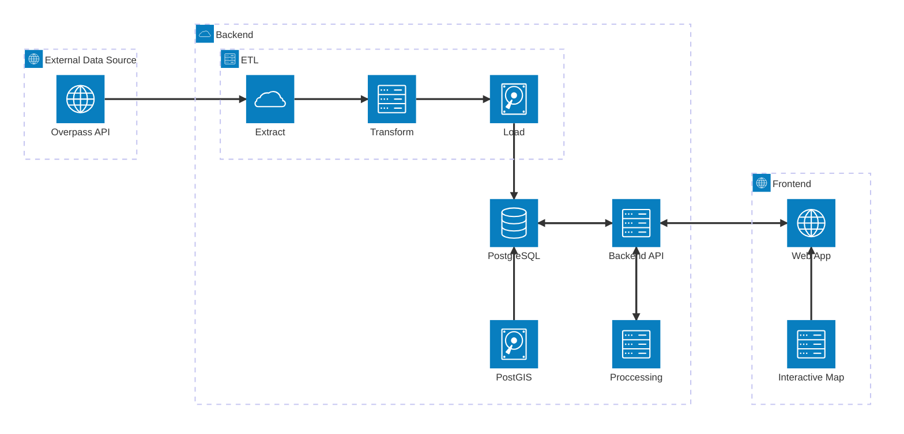
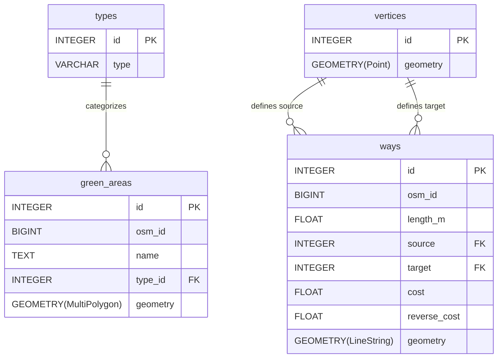

#  [GSA: Green Space Accessibility](https://aumgupta.github.io/GSA/)

This repository hosts the source code for the [**GSA**](https://aumgupta.github.io/GSA/) Project, a geospatial web application that evaluates urban green space accessibility by integrating OpenStreetMap data, spatial ETL processing, PostGIS analytics, and an interactive map-based frontend.

> [!note]
> This project is presented for the course "Group Project Seminar on Programming and Analysis".

### Application Architecture

The system follows a three-tier architecture: 
1. **External** data source: OSM OverPass API
2. **Backend** (ETL pipeline, PostGIS-enabled PostgreSQL database, and API)
3. **Frontend** web application

## Database Schema

* **`types`**: A lookup table for green area classifications.
* **`green_areas`**: Stores the polygonal geometry and metadata for parks and forests.
* **`vertices`**: The nodes (intersections) of the routing network.
* **`ways`**: The edges (streets/paths) of the network, including `cost` and `reverse_cost` for pgRouting calculations.

### ER Diagram

> [!IMPORTANT]
> The schema includes **GIST (Generalized Search Tree)** indices on all geometry columns to ensure high-performance spatial queries.

## Team
[**Om Gupta**](https://github.com/AumGupta) & [**Santiago José Lara**](https://github.com/SLara24)
