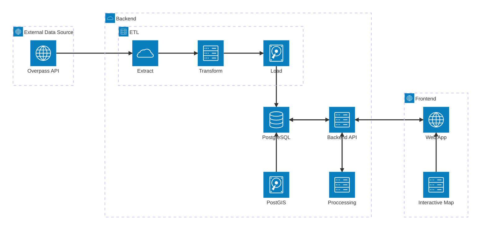
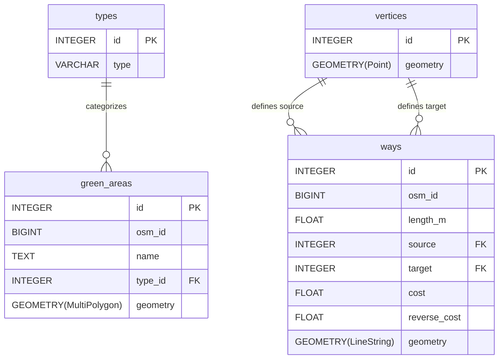

#  [GSA: Green Space Accessibility](https://aumgupta.github.io/GSA/)


This repository hosts the source code for the [**GSA**](https://aumgupta.github.io/GSA/) Project, a geospatial web application that evaluates urban green space accessibility by integrating OpenStreetMap data, spatial ETL processing, PostGIS analytics, and an interactive map-based frontend.

> [!note]
> This project is presented for the course "Group Project Seminar on Programming and Analysis".

### Application Architecture

The system follows a three-tier architecture: 
1. **External** data source: OSM OverPass API
2. **Backend** (ETL pipeline, PostGIS-enabled PostgreSQL database, and API)
3. **Frontend** web application


```mermaid
architecture-beta

    group datasource(internet)[External Data Source]
    group backend(cloud)[Backend]
    group etl(server)[ETL] in backend
    group frontend(internet)[Frontend]

    %% External
    service overpass(internet)[Overpass API] in datasource

    %% Backend - ETL
    service extract(cloud)[Extract] in etl
    service transform(server)[Transform] in etl
    service load(disk)[Load] in etl

    %% Backend - Database
    service postgres(database)[PostgreSQL] in backend
    service postgis(disk)[PostGIS] in backend

    %% Backend - API
    service api(server)[Backend API] in backend
    service scoring(server)[Proccessing] in backend

    %% Frontend
    service web(internet)[Web App] in frontend
    service map(server)[Interactive Map] in frontend


    %% Data Flow
    overpass:R --> L:extract

    extract:R --> L:transform
    transform:R --> L:load
    load:B --> T:postgres

    postgis:T --> B:postgres
    postgres:R --> L:api
    api:L --> R:postgres

    api:R <--> L:web


    api:B --> T:scoring
    scoring:T --> B:api
    map:T --> B:web
```


## Database Schema

* **`types`**: A lookup table for green area classifications.
* **`green_areas`**: Stores the polygonal geometry and metadata for parks and forests.
* **`vertices`**: The nodes (intersections) of the routing network.
* **`ways`**: The edges (streets/paths) of the network, including `cost` and `reverse_cost` for pgRouting calculations.

### ER Diagram


```mermaid
erDiagram
    types ||--o{ green_areas : "categorizes"
    vertices ||--o{ ways : "defines source"
    vertices ||--o{ ways : "defines target"

    types {
        INTEGER id PK
        VARCHAR type
    }

    green_areas {
        INTEGER id PK
        BIGINT osm_id
        TEXT name
        INTEGER type_id FK
        GEOMETRY(MultiPolygon) geometry
    }

    vertices {
        INTEGER id PK
        GEOMETRY(Point) geometry
    }

    ways {
        INTEGER id PK
        BIGINT osm_id
        FLOAT length_m
        INTEGER source FK
        INTEGER target FK
        FLOAT cost
        FLOAT reverse_cost
        GEOMETRY(LineString) geometry
    }

```

> [!IMPORTANT]
> The schema includes **GIST (Generalized Search Tree)** indices on all geometry columns to ensure high-performance spatial queries.

## API

The project exposes a RESTful API built with **FastAPI**.
The API acts as the communication layer between the PostgreSQL/PostGIS database and the frontend application, allowing spatial analysis, accessibility evaluation, routing, and user feedback storage.

The API is organized into three main components:

```
API/
│── routers/
│── db/
│── main.py
```

---

### 1. `main.py`

`main.py` is the application entry point.
It initializes the FastAPI application and registers all routers under the `/api/v1` prefix.

Its responsibilities include:

* Creating the FastAPI app instance
* Including all API routers
* Exposing the endpoints to the web server (Uvicorn)

---

### 2. `db/`

The `db` module manages the connection with the PostgreSQL database.

It provides:

* Database engine configuration
* Session management
* Dependency injection (`get_db`) used by the routers

All endpoints access the database through this module, ensuring that connections are opened and closed safely during each request.

---

### 3. `routers/`

The `routers` directory contains the API endpoints grouped by functionality.
Each router defines specific operations and queries executed on the PostGIS database.

#### a. `spatial` (GET)

Provides basic spatial queries.
It receives geographic coordinates (latitude and longitude) and retrieves nearby green areas from the database.

Main functionality:

* Query green areas
* Spatial filtering using PostGIS geometry operations

---

#### b. `accessibility` (GET)

Calculates the **green space accessibility index** for a given location.

The endpoint analyzes green areas within a specified buffer distance and computes multiple indicators:

* **Proximity score** – distance to the nearest green area
* **Quantity score** – number of green areas in range
* **Area score** – total surface of accessible green areas
* **Diversity score** – variation of green area types

This module performs spatial analysis directly in PostGIS and returns a structured JSON response with the computed indicators.

---

#### c. `routing` (GET)

Computes the walking route from a user location to the nearest green area.

The routing process uses **pgRouting** and the OpenStreetMap road network stored in the database.

Steps performed:

1. Snap the user coordinates to the closest network vertex
2. Identify the nearest green area
3. Snap the park centroid to the road network
4. Calculate the shortest path using Dijkstra’s algorithm
5. Return the route as GeoJSON

The endpoint returns:

* Destination park name
* Route distance (meters)
* Connectivity status
* Route geometry (GeoJSON LineString)

---

#### d. `feedback` (POST)

Stores user feedback and calculated accessibility results.

The endpoint receives a JSON payload from the frontend and inserts it into the database.
This allows the application to keep a record of user interactions and computed scores.

---

## Request/Response Format

All endpoints communicate using JSON.
Spatial outputs such as routes are returned in **GeoJSON format**, making them directly compatible with web mapping libraries such as Leaflet or Mapbox GL JS.

---

## Summary

The API integrates:

* **FastAPI** → request handling
* **PostgreSQL/PostGIS** → spatial database
* **pgRouting** → network analysis

It serves as the analytical backend of the application, providing spatial queries, accessibility evaluation, routing computation, and persistent user feedback storage.


## Team
[**Om Gupta**](https://github.com/AumGupta) & [**Santiago José Lara**](https://github.com/SLara24)
