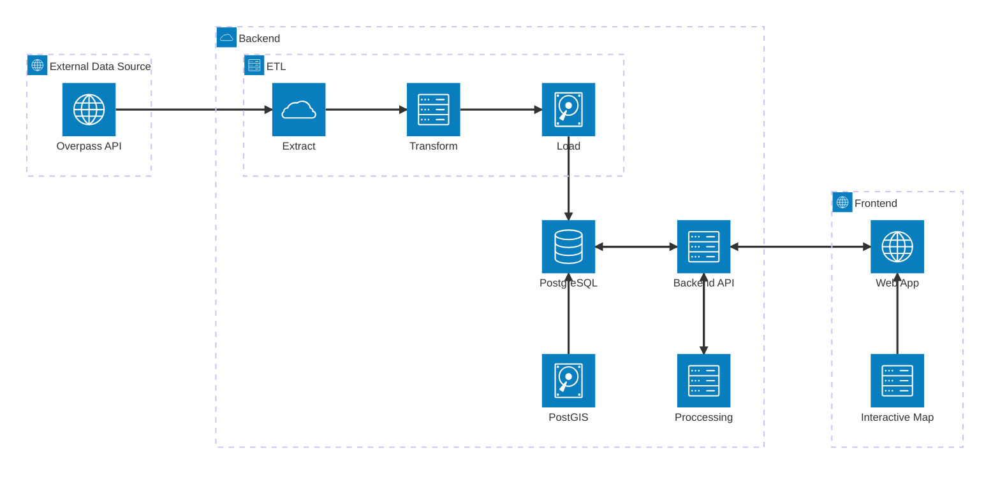
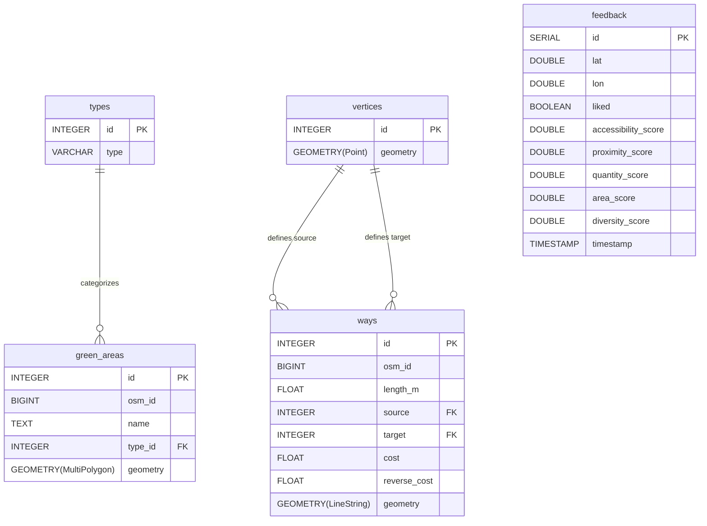

#  [GSA: Green Space Accessibility](https://aumgupta.github.io/GSA/)


This repository hosts the source code for the [**GSA**](https://aumgupta.github.io/GSA/) Project, a geospatial web application that evaluates urban green space accessibility by integrating OpenStreetMap data, spatial ETL processing, PostGIS analytics, and an interactive map-based frontend.

> [!note]
> This project is presented for the course "Group Project Seminar on Programming and Analysis".

### Application Architecture

The system follows a three-tier architecture: 
1. **External** data source: OSM OverPass API
2. **Backend** (ETL pipeline, PostGIS-enabled PostgreSQL database, and API)
3. **Frontend** web application


```mermaid
architecture-beta

    group datasource(internet)[External Data Source]
    group backend(cloud)[Backend]
    group etl(server)[ETL] in backend
    group frontend(internet)[Frontend]

    %% External
    service overpass(internet)[Overpass API] in datasource

    %% Backend - ETL
    service extract(cloud)[Extract] in etl
    service transform(server)[Transform] in etl
    service load(disk)[Load] in etl

    %% Backend - Database
    service postgres(database)[PostgreSQL] in backend
    service postgis(disk)[PostGIS] in backend

    %% Backend - API
    service api(server)[Backend API] in backend
    service scoring(server)[Proccessing] in backend

    %% Frontend
    service web(internet)[Web App] in frontend
    service map(server)[Interactive Map] in frontend


    %% Data Flow
    overpass:R --> L:extract

    extract:R --> L:transform
    transform:R --> L:load
    load:B --> T:postgres

    postgis:T --> B:postgres
    postgres:R --> L:api
    api:L --> R:postgres

    api:R <--> L:web


    api:B --> T:scoring
    scoring:T --> B:api
    map:T --> B:web
```


## Database Schema

* **`types`**: A lookup table for green area classifications.
* **`green_areas`**: Stores the polygonal geometry and metadata for parks and forests.
* **`vertices`**: The nodes (intersections) of the routing network.
* **`ways`**: The edges (streets/paths) of the network, including `cost` and `reverse_cost` for pgRouting calculations.

### ER Diagram


```mermaid
erDiagram
    types ||--o{ green_areas : "categorizes"
    vertices ||--o{ ways : "defines source"
    vertices ||--o{ ways : "defines target"

    types {
        INTEGER id PK
        VARCHAR type
    }

    green_areas {
        INTEGER id PK
        BIGINT osm_id
        TEXT name
        INTEGER type_id FK
        GEOMETRY(MultiPolygon) geometry
    }

    vertices {
        INTEGER id PK
        GEOMETRY(Point) geometry
    }

    ways {
        INTEGER id PK
        BIGINT osm_id
        FLOAT length_m
        INTEGER source FK
        INTEGER target FK
        FLOAT cost
        FLOAT reverse_cost
        GEOMETRY(LineString) geometry
    }

    feedback {
        SERIAL id PK
        DOUBLE lat
        DOUBLE lon
        BOOLEAN liked
        DOUBLE accessibility_score
        DOUBLE proximity_score
        DOUBLE quantity_score
        DOUBLE area_score
        DOUBLE diversity_score
        TIMESTAMP timestamp
    }

```

> [!IMPORTANT]
> The schema includes **GIST (Generalized Search Tree)** indices on all geometry columns to ensure high-performance spatial queries.

## API

| Endpoint                                    | Method | Description / Flow                                                            |
| ------------------------------------------- | ------ | ----------------------------------------------------------------------------- |
| `/`                                         | GET    | Base endpoint – verify API connectivity.                                      |
| `/api/v1/green-area`                        | GET    | Get details of green areas. Flow: Location → GET → Area Data                  |
| `/api/v1/green-area-buffer`                 | GET    | Get green areas within buffer. Flow: Location + Buffer → GET → Filtered Data  |
| `/api/v1/accessibility/accessibility-score` | GET    | Compute accessibility score. Flow: Coordinates → Compute → Score              |
| `/api/v1/routing/to-nearest-park`           | GET    | Get optimal route to nearest park. Flow: Coordinates → Calculate → Directions |
| `/api/v1/feedback/`                         | POST   | Submit user feedback. Flow: Feedback → POST → Stored → Analytics/Improvements |

Check out the entire API documentation [here](https://gsa-u4t8.onrender.com/docs#/).

> [!note]
> The API documentation might take a while to open, be patient.

---

Here is the **corrected and concise** version of your “Running Locally” section reflecting the actual setup:

---

## Running Locally

> [!note]
> The application is already deployed. The steps below are only needed if you want to run the full stack locally. It can be done using the following simple 8 steps.

### 1. Requirements

Install:

* **Python 3.10+**
* **PostgreSQL (v14+)**
* **PostGIS**
* **pgRouting**
* **Git**


### 2. Clone the Repository

```bash
git clone https://github.com/AumGupta/GSA.git
cd GSA
```

### 3. Install Python Dependencies

Create a virtual environment (optional but recommended), then install dependencies:

```bash
pip install -r requirements.txt
```

### 4. Configure Environment Variables

Create a `.env` file in the project root:

```
DB_HOST=localhost
DB_PORT=5432
DB_NAME=green_accessibility
DB_USER=postgres
DB_PASSWORD=your_password
```


### 5. Setup the Database Schema

Create the database and enable extensions:

```sql
CREATE DATABASE green_accessibility;
\c green_accessibility;

CREATE EXTENSION postgis;
CREATE EXTENSION pgrouting;
```

Then run the provided schema file:

```bash
psql -U postgres -d green_accessibility -f ETL/sql/schema.sql
```


### 6. Populate the Database (ETL)

After the schema is created, populate the database by running:

```bash
python ETL/main.py
```

This will load and process the required spatial data.


### 7. Run the API Locally

Start the FastAPI server:

```bash
uvicorn API.main:app --reload
```

The API will run at:

```
http://127.0.0.1:8000
```


### 8. Connect the Frontend to the Local API

Update the API base URL in:

```
docs/js/script.js
```

Change the `API_BASE_URL` to:

```javascript
const API_BASE_URL = "http://127.0.0.1:8000"
```

This ensures the frontend connects to your local API (and therefore your local PostgreSQL database).

## Team
[**Om Gupta**](https://github.com/AumGupta) & [**Santiago José Lara**](https://github.com/SLara24)
